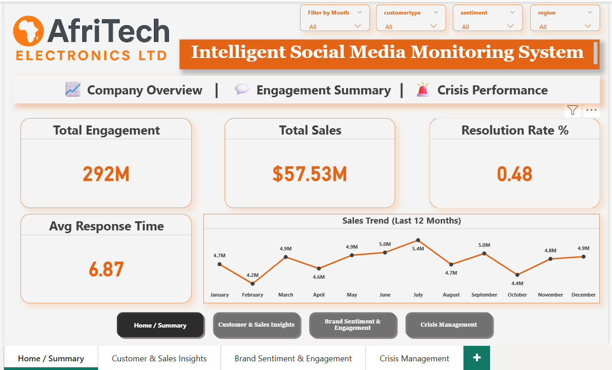
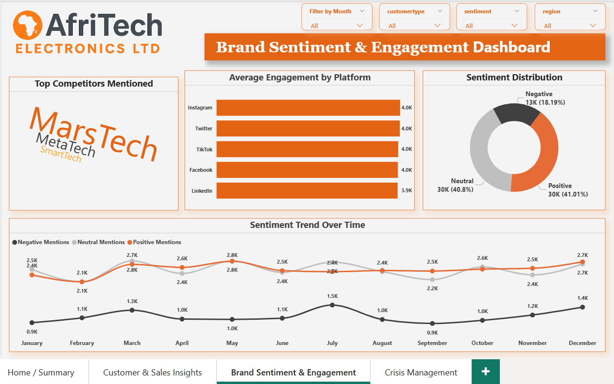
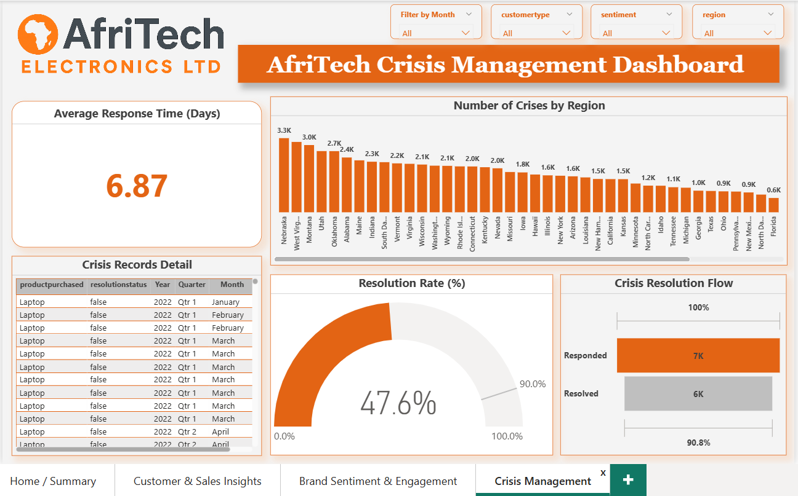

# AfriTech Electronics — Power BI Dashboard

## Project Overview

This Power BI project analyzes business performance for AfriTech Electronics, focusing on sales trends, customer behavior, brand sentiment, and crisis response metrics. The dashboard transforms raw operational and social engagement data into clear, actionable insights to support strategic decision-making.

## Dashboard Pages

### Home / Summary

### Customer & Sales Insights

### Brand Sentiment & Engagement

### Crisis Management Analysis

## Key Business Questions

* How are total sales and revenue trending over time?
* Which products and regions drive the highest performance?
* How do different customer segments contribute to revenue?
* What is the overall brand sentiment across platforms?
* How effective is crisis response and resolution performance?

## Dashboard Features

* Interactive KPI cards for revenue, customers, and engagement
* Sales and product performance analysis
* Customer segmentation and income insights
* Brand sentiment and influencer impact tracking
* Crisis event monitoring and response time analysis
* Dynamic filters for year, region, product, and platform

## Tools & Technologies

* Power BI
* Power Query
* DAX Measures
* Data Modeling
* Data Cleaning & Transformation
