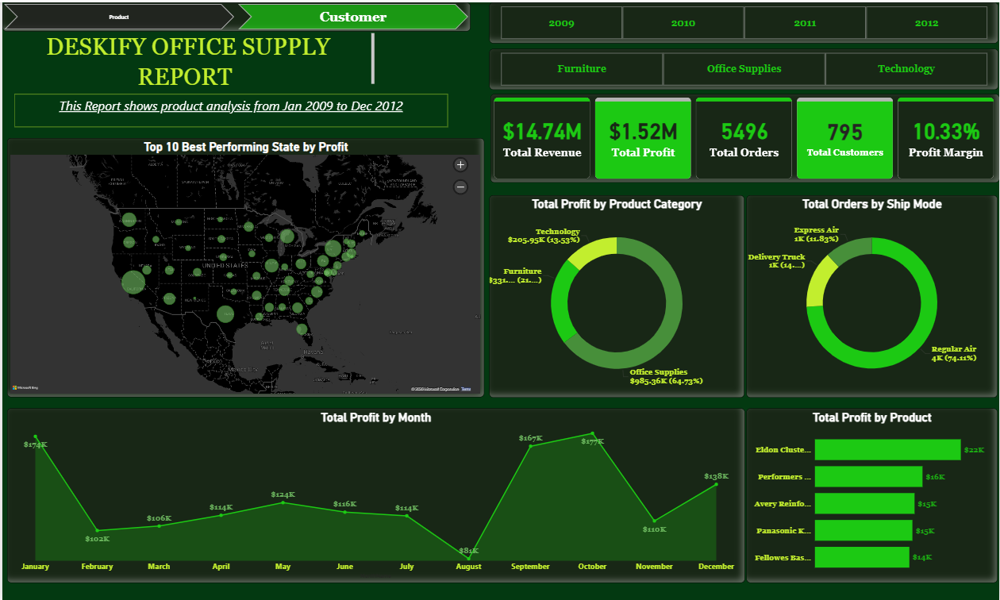
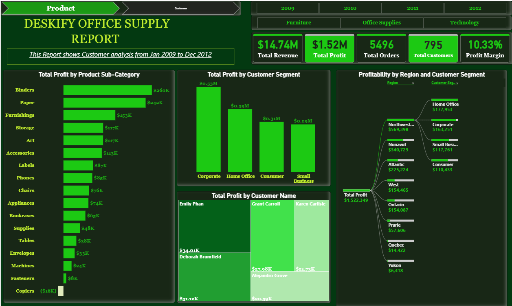

# Deskify Office Supplies — Power BI Dashboard

## Project Overview
This Power BI project analyzes Deskify’s office supply sales and operational performance to uncover trends in revenue, product demand, customer behavior, and regional performance. The dashboard provides stakeholders with a clear, interactive view of key business metrics to support data-driven decision-making.

## Key Objectives
- Analyze total sales, profit, and order trends over time  
- Identify top-performing and underperforming products  
- Evaluate customer segments and purchasing behavior  
- Assess regional and category-level performance  
- Support inventory planning and sales strategy optimization

## Dashboard Preview

### Product Performance

### Customer Insights

## Dashboard Highlights
- Sales and profit KPIs  
- Product and category performance analysis  
- Customer segmentation insights  
- Regional sales distribution  
- Time-series trends and comparisons  

## Tools Used
- Power BI (Data modeling, DAX, interactive visuals)
- Excel (Source data preparation)

## Notes
This project demonstrates practical business intelligence reporting using Power BI, with a focus on clear storytelling, usability, and actionable insights.
