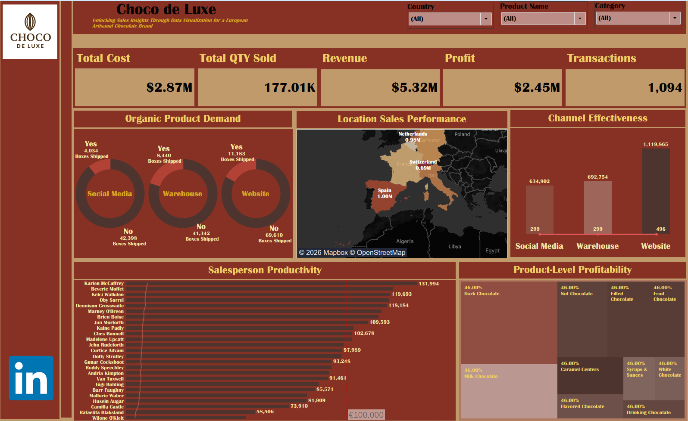

# Choco De Luxe — Tableau Sales & Delivery Performance Dashboard

## Live Dashboard
- Tableau Public: ([LIVE](https://public.tableau.com/app/profile/emmanuella.odinukwe/vizzes))

## Project Overview
Choco De Luxe is a premium chocolate retailer. This Tableau dashboard analyzes sales performance, profitability, delivery success, channel effectiveness, and organic product demand to help stakeholders understand what is driving revenue and where operational improvements are needed.

## Objectives
- Track revenue, cost, profit, and profit margin over time
- Measure delivery completion performance (success rate)
- Identify top-performing locations and regions
- Evaluate which sales channels drive the most profitable transactions
- Compare organic vs non-organic product demand
- Assess salesperson productivity and product-level profitability`

## Dashboard Pages / Views
This project includes multiple analytical views such as:
- Revenue, Cost, Profit, Profit Margin (KPIs)
- Delivery Success Rate
- Channel Effectiveness
- Location Sales Performance
- Organic Product Demand
- Product-Level Profitability
- Salesperson Productivity
- Transactions & Quantity Sold

## Insights This Dashboard Enables
- Which regions/cities contribute the highest revenue and profit
- Which channels generate strong sales but lower profitability (margin pressure)
- Whether delivery performance is impacting customer experience and repeat sales
- Which products/categories should be prioritized based on profitability and demand
- How organic product preference varies across locations and channels
