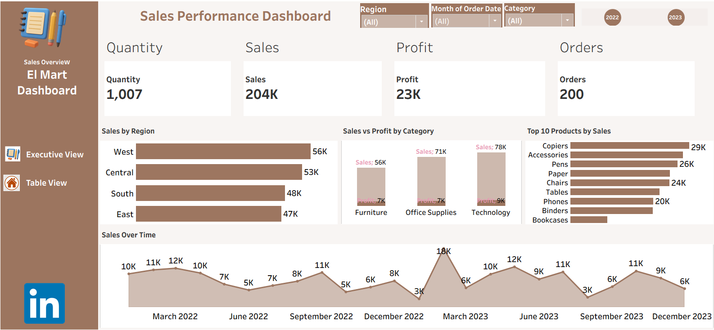
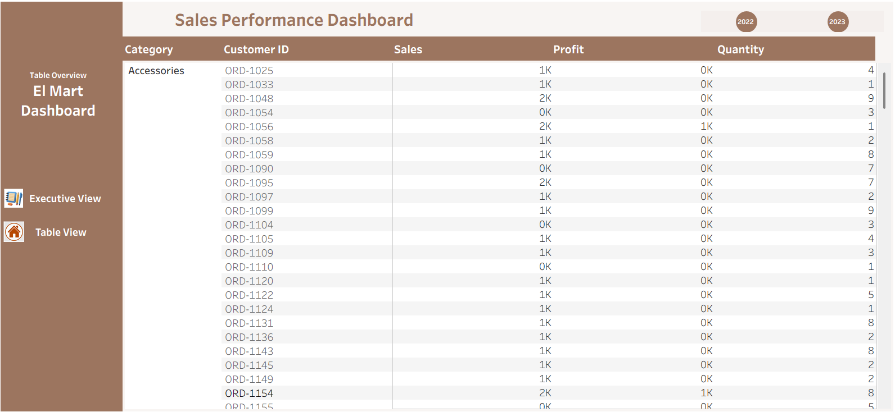

# El Mart — Retail Sales & Profitability Dashboard (Tableau)

## 📌 Project Overview
The El Mart Tableau Dashboard is an interactive retail analytics solution designed to evaluate overall business performance across revenue, profit, product demand, and regional sales distribution.

This dashboard transforms raw transactional retail data into actionable business insights using calculated metrics, KPI tracking, and dynamic filtering. It enables stakeholders to monitor performance trends, identify high-performing categories, and assess profitability across multiple dimensions.

---

## 🎯 Business Objectives
The goal of this project is to:

- Monitor total revenue and profit performance
- Track profit margin across products and categories
- Identify top-performing and underperforming products
- Analyze regional and location-based sales trends
- Evaluate transaction volume and customer purchasing patterns
- Support data-driven retail decision-making

---

## 📊 Analytical Views Included

The dashboard provides:

- Executive KPI summary section
- Sales trend analysis over time
- Category and product-level performance breakdown
- Regional and location-based sales analysis
- Profitability comparison across segments
- Interactive filters for dynamic exploration

---

## 💡 Business Value

The El Mart dashboard enables stakeholders to:

- Detect revenue growth patterns
- Identify margin pressure areas
- Optimize product assortment strategy
- Improve regional sales targeting
- Support performance monitoring and forecasting

