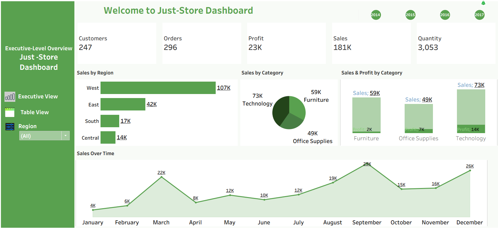
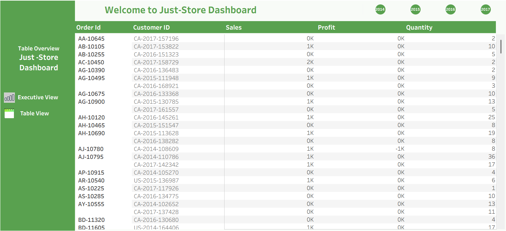

## 📌 Project Description

The Just Store Tableau Dashboard is an interactive retail analytics solution designed to evaluate overall business performance across sales, profitability, customer purchasing behavior, and regional trends.

This dashboard consolidates transactional retail data into a structured visual analytics interface that enables stakeholders to monitor revenue growth, profit performance, product demand, and regional sales distribution in real time.

Built using Tableau, the dashboard transforms raw retail data into actionable insights through calculated fields, KPI summaries, and dynamic filtering capabilities.

## 🎯 Business Objective

## The goal of this project is to:

- Monitor overall revenue and profit performance

- Identify top-performing products and categories

- Evaluate regional and location-based sales trends

- Track order volume and transaction behavior

- Support strategic retail decisions using data-driven insights

## 🔍 Analytical Focus Areas

## The dashboard allows users to explore:

- Sales performance by region and location

- Product profitability and demand distribution

- Category-level revenue contribution

- Trend analysis over time

- Comparative performance across business segments

## Interactive filters enable drill-down analysis by:

- Date

- Product / Category

- Region

- Sales dimensions

## 💡 Business Value

## This dashboard empowers retail decision-makers to:

- Identify underperforming categories

- Optimize product assortment

- Improve regional sales strategy

- Monitor profitability trends

- Support revenue forecasting and performance evaluation
